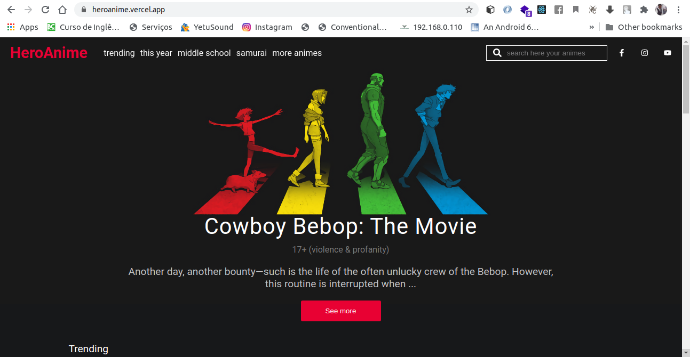
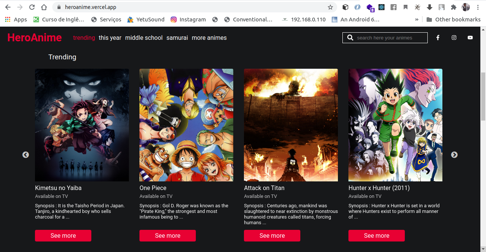
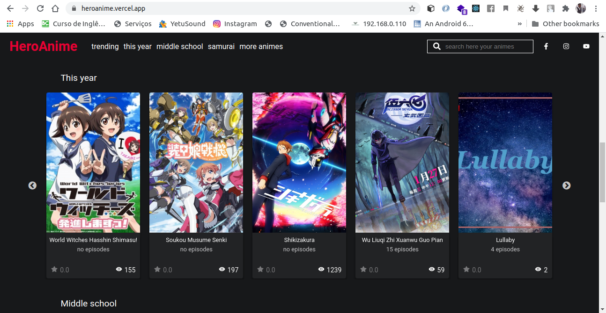
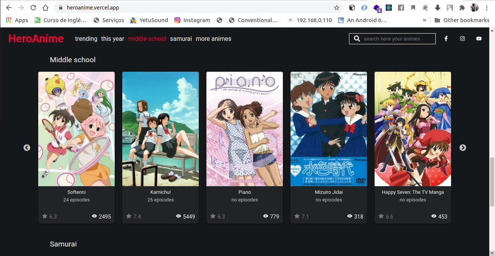
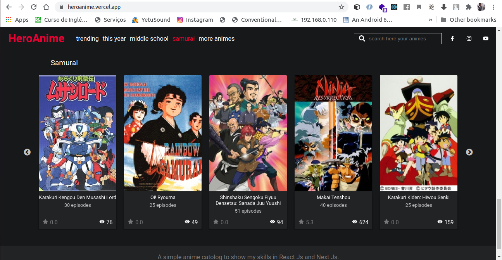

# Hero Anime
>A simple anime catalogs 

Hero anime is a responsive website created to show anime information, such as name, number of episodes and trailler if available.

	


## Instalation 	

Go to cmd and run the code below 	

```sh	
yarn install	
```	

After all dependecies installed	

**To run**	

```sh	
yarn dev 	
```	
## Project features

* Trending animes

A list of 10 animes to be released soon
 
```sh	
https://kitsu.io/api/edge//trending/anime
```	

	

* This year

A list of 10 animes to be released this year
 
```sh	
https://kitsu.io/api/edge/anime?filter[seasonYear]=year
```	
	

* Midle school

A list of 10 high school anime
 
```sh	
https://kitsu.io/api/edge/anime?filter[categories]=midle-school
```	
	

* Samurai

A list of 10 samurai anime
 
```sh	
https://kitsu.io/api/edge/anime?filter[categories]=samurai
```	
	
