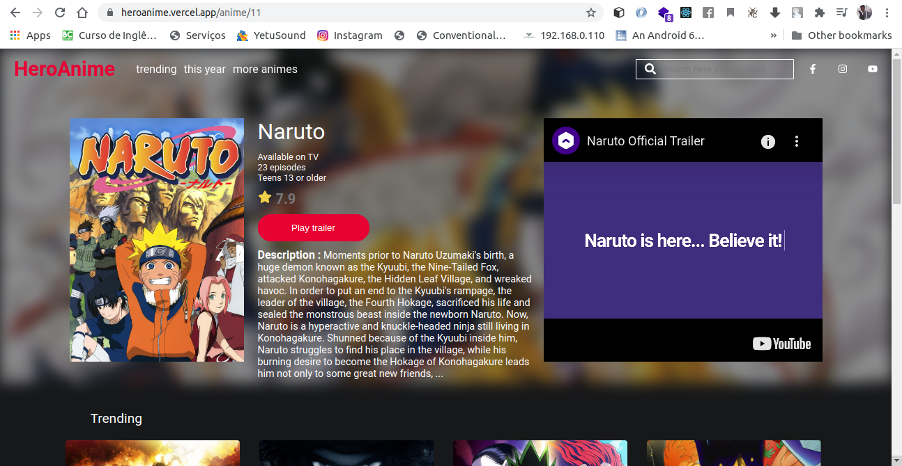
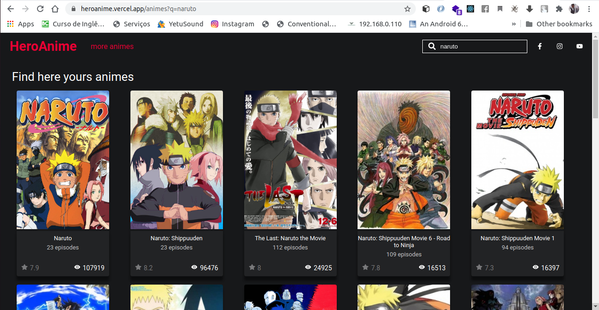
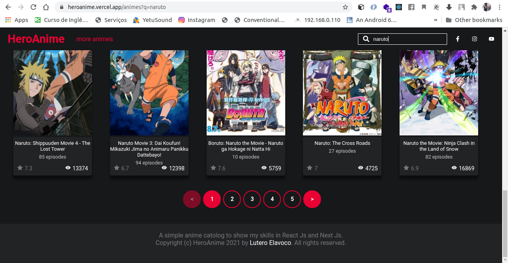

# Hero Anime
>A simple anime catalogs 

Hero anime is a responsive website created to show anime information, such as name, number of episodes and trailler if available.

	


## Instalation 	

Go to project terminal and run the code below 	

```sh	
yarn install	
```	

After all dependecies installed	

**To run**	

```sh	
yarn dev 	
```	
## Project structure
```
.

├── src/
|   ├── components/                 # all components of project
|   |   ├── Layout/                  
|   |   |   ├── index.tsx           # define the main structure of the project
|   |   |   ├── styles.less         # styling of components
|   |   ├── Nav/
|   |   |   ├── helpers/
|   |   |   |   ├── index.ts        # functions and vars used in nav    
|   |   |   ├── LeftMenu/           
|   |   |   |   ├── index.ts        # left nav bar components
|   |   |   |   ├── index.less      # styling of component
|   |   |   ├── RigthMenu/
|   |   |   |   ├── index.ts        # right nav bar components
|   |   |   |   ├── index.less      # styling of component
|   |   |   ├── index.tsx           # component that allows browse the pages 
|   |   |   ├── styles.less           # styling of components
|   |   ├── Header/                  
|   |   |   ├── index.tsx           # home page header component
|   |   |   ├── styles.less         # styling of components
|   |   ├── ListAnimes      
|   |   |   ├── helpers/
|   |   |   |   ├── slider.ts       # slider settings 
|   |   |   ├── index.tsx           # component that allows the listing of animes by category
|   |   |   ├── styles.less         # styling of components
|   |   ├── CardAnime/              
|   |   |   ├── index.tsx           # card that shows anime information
|   |   |   ├── styles.less           # styling of components
|   |   ├── ListTrending
|   |   |   ├── helpers/
|   |   |   |   ├── slider.ts       # slider settings 
|   |   |   ├── index.tsx           # component that allows the listing of trending anime
|   |   |   ├── styles.less         # styling of components
|   |   ├── CardTrendig/             
|   |   |   ├── index.tsx           # card that shows anime trending information
|   |   |   ├── styles.less         # styling of components
|   |   ├── Pagination/
|   |   |   ├── helpers/
|   |   |   |   ├── index.ts        # pagination function implementation 
|   |   |   ├── index.tsx           # component that lets you page search results
|   |   |   ├── styles.less         # styling of components
|   |   ├── helpers/                
|   |   |   ├── interface.ts        # project interfaces            
|   ├── pages/                      # all project pages.
|   |   ├── anime/                  # page of selected anime
|   |   |   └── [id].tsx            # 
|   |   ├── animes/                 # page of searched anim
|   |   |   └── index.tsx           # 
|   |   ├── \_app.tsx               
|   |   ├── \_document.tsx          
|   |   └── index.tsx               # index page
|   ├── context/                    # global states
|   |   └── search.tsx              #       
|   ├── services/                   # all project external services
|   |   └── api.ts                  # axios elements initilized to call external resources
|   |   └── fakeapi.ts              # a specific anime to simulate a call for anime that can be put as the header of the home page   
|   |   └── animeType.d.ts          # anime json type
|   ├── styles/                     # all project pages.
|   |   ├── pages/
|   |   |   └── Anime.less             
|   |   |   └── Animes.less            
|   |   |   └── Home.less              
|   |   └── global.less             # global style of project 
|   |   └── theme.less              # project theme
|   ├── utils/                      # all project pages.
|   |   ├── anime.ts
├── README.md
└── ...
```

## Project features

* Trending animes

A list of 10 animes to be released soon
 
```sh	
https://kitsu.io/api/edge//trending/anime
```	

	

* This year

List of 10 animes to be released this year
 
```sh	
https://kitsu.io/api/edge/anime?filter[seasonYear]=2021
```	
	

* Midle school

List of 10 high school anime
 
```sh	
https://kitsu.io/api/edge/anime?filter[categories]=midle-school
```	
	

* Samurai

List of 10 samurai anime
 
```sh	
https://kitsu.io/api/edge/anime?filter[categories]=samurai
```	
	

* Select anime

show selected anime information
 
```sh	
https://kitsu.io/api/edge/anime/11
```	
	

* Search anime

Search for an interesting anime
 
```sh	
https://kitsu.io/api/edge/anime?filter[text]=naruto
```	
	

* Pagination on searching

Pagination for search results
 
```sh	
https://kitsu.io/api/edge/anime?filter[text]=naruto&page[limit]=20&page[offset]=0
```	
	

## Meta	

Author - Lutero Elavoco

programmer -  [Lutero Elavoco](https://www.linkedin.com/in/l%C3%BAtero-elavoco-5951b619b/) - luteroelavoco90@gmail.com	

https://heroanime.vercel.app/

## Contributing 	

1. Fork it (https://github.com/cientista1/heroanime)	
2. Create your feature branch (`git checkout -b feature/fooBar`)	
3. Commit your changes (`git commit -am 'Add some fooBar'`)	
4. Push to the branch (`git push origin feature/fooBar`)	
5. Create a new Pull Request
